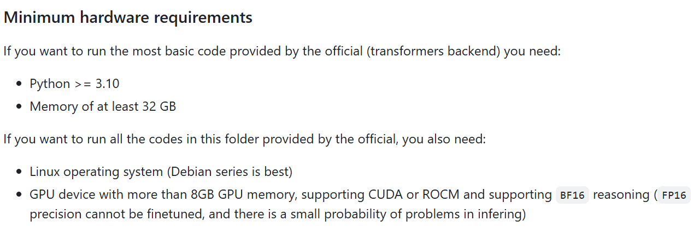
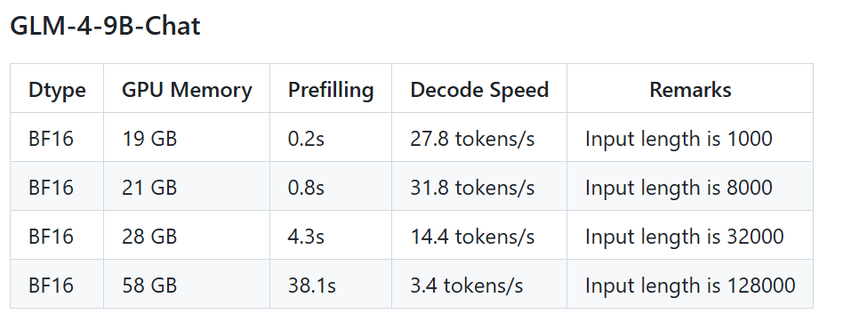
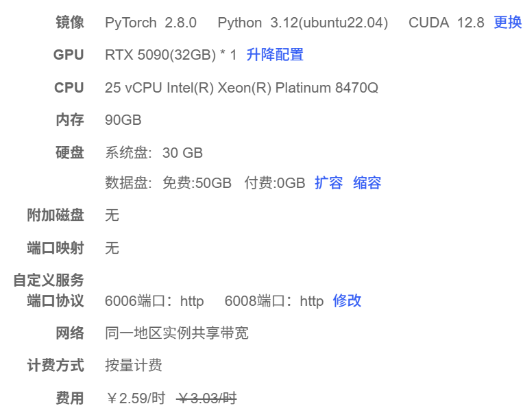

# Part 1 

## 1. Development Tasks

1. Integrate GLM4-9B-Chat(Local) and DeepSeek(api).
2. Implement a restful API using FastAPI.
3. Validate endpoint with Postman.

Deliverable: conversation with llm via api


## 2. Setup
### 2.1 Server Setup
#### 2.1.1 Server Requirement



Rent the server from autodl


#### 2.1.2 Connect Server
Final shell (remote connection with system resource visualization)

VSCode with Remote - SSH plugin (remote connection for coding)

### 2.2 Environment Setup
#### 2.2.1 Project 
```
conda create --name ragqa python==3.10
```
The below is for jupyterlab test env
```
python -m ipykernel install --user --name ragqa --display-name ragqa_jl
```
#### 2.2.2 GLM-4-9B
```
conda create --name glm4 python==3.11
pip install -r requirements.txt
```
install gpu pytorch based on the server cuda version

download [model weight file from hugging face](https://huggingface.co/zai-org/glm-4-9b-chat/tree/main)

[Deploy OpenAI API Server for glm4_9b_chat](https://github.com/zai-org/GLM-4/tree/adeeb0e8e0a461ed6882fc4743b0d5948890e8f2/basic_demo)

Change filepath of the model weight in their server file.

Run the server script


### 2.3 Foundations
#### 2.3.1 LLM
```
jupyter lab --allow-root
```
GLM4_9b_chat (local): *glm4_9b_chat_basic_test.ipynb*

GLM4 (API): *glm4_basic_test.ipynb*

Langchain (version 0.2): *langchainV02.ipynb*

#### 2.3.2 FastAPI
FastAPI: 
Starlette is a framework that implements ASGI(Asynchronous Server Gateway Interface),

FastAPI builds on top of Starlette as a higher-level abstraction (another framework).

Uvicorn is the server application to run FastAPI

Check the main code now


curl --location 'http://127.0.0.1:8000/api/chat' \
--header 'Content-Type: application/json' \
--data '{
    "query": "please introduce yourself",
    "model_name": "glm-4",
    "temperature": 0.8,
    "max_tokens": 4096
}'