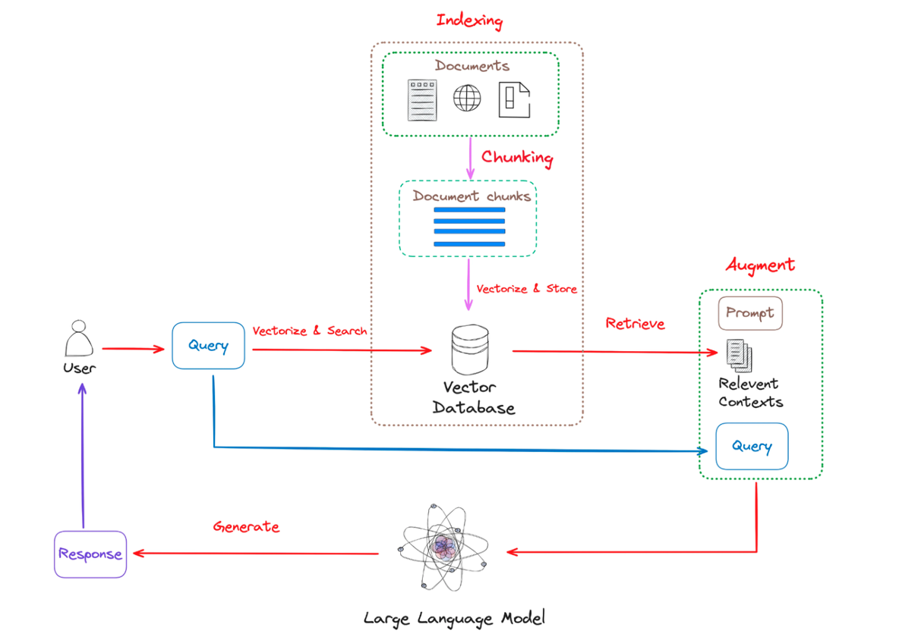
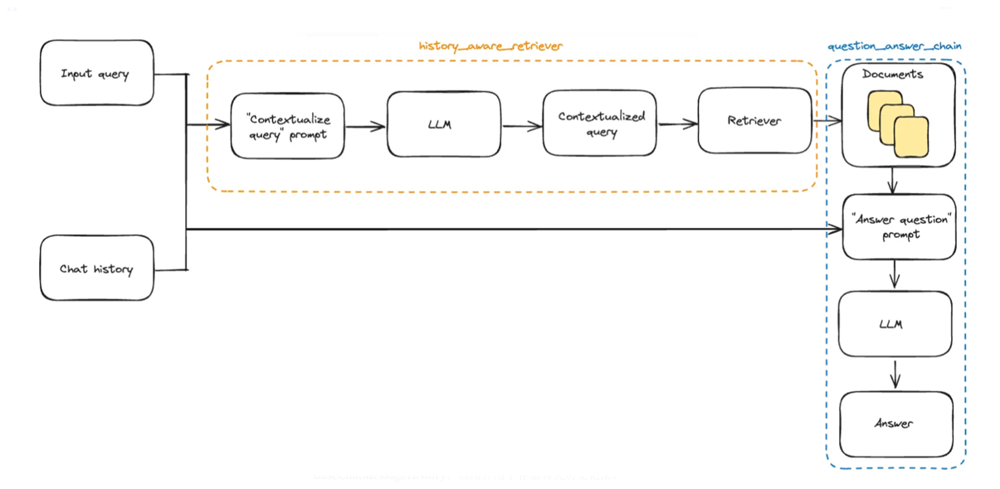
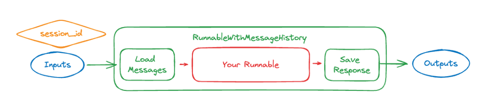

# Part 2 

## 1. Development Tasks

## 2. RAG Foundation
### 2.1 Without History
*langchain_rag.ipynb*

### 2.2 With History (stored in cache)
*langchain_rag_history.ipynb*

Improve Retrieve part 

and include session_id and store in dictionary

### 2.3 With History (stored in sqlite)
*langchain_rag_sqlite.py*